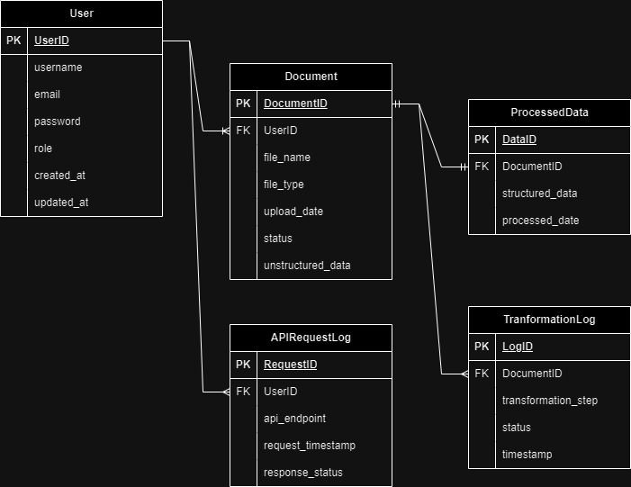
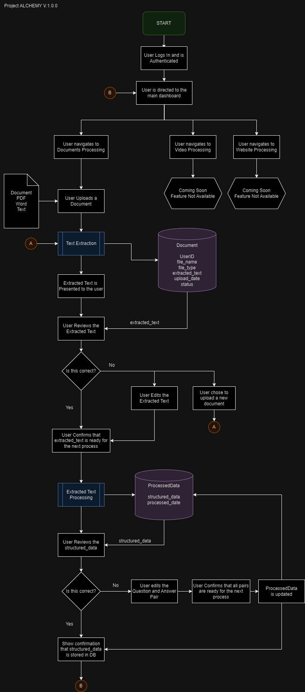

# Alchemy

### Overview

**Alchemy** is a document processing application designed to transform content from multiple formats and mediums (e.g., PDFs, DOCX, web pages, etc.) into a format suitable for training large language models (LLMs). The goal is to ensure that this data is structured in a way that makes it easy to integrate with LLMs, enabling intelligent systems to access and deliver accurate, relevant information.

The app runs locally but also has the ability to:
- Push processed data to **cloud storage** or **Voiceflow** to support **retrieval-augmented generation (RAG)**.
- Connect to the internet for backend API calls to ensure seamless data handling and integration with external services.

Built using **Docker** and the **Django REST framework**, Alchemy ensures modularity, scalability, and ease of deployment, making it adaptable for various use cases, including future upgrades.

### Features

- **Content Ingestion**: Supports various file formats such as PDFs, DOCX, and potentially web pages for extracting content.
- **Data Transformation**: Processes content into structured data that can be used for training or fine-tuning LLMs.
- **Cloud Integration**: Pushes processed data to cloud storage or third-party systems such as Voiceflow for enhanced AI-driven responses.
- **Internet Connectivity**: Handles backend API calls to interact with external systems for data integration or updates.

### Future Expansion

Alchemy has the potential to evolve into a full-fledged data-gathering app, allowing it to:
- **Scrub webpages and social media** platforms to collect relevant data and continuously update its knowledge base.
- Provide automated, real-time data extraction to keep AI systems updated with the latest information from online sources.

### Technology Stack

- **Docker**: For containerized and portable deployments.
- **Django REST Framework**: Backend for API calls and handling data processing.
- **Python Libraries**: Tools for document parsing and transformation (e.g., PyPDF2, python-docx).

### Usage

1. **Local Deployment**:
   - Clone the repository and ensure Docker is installed on your system.
   - Build and run the Docker container to start the application.
   
   ```bash
   docker-compose up --build
   ```

2. **Data Processing**:

   - Upload the documents or content you want to process.
   - The app will extract and transform the content into structured data.
   - The structured data can then be pushed to cloud storage or external services for further use.

3. **Future Updates**:
   - Alchemy will support additional features such as continuous data gathering from web sources and social media for AI systems.

# ERD for Project Alchemy - Variable Descriptions



## 1. User
### Attributes:
- **user_id (PK)**: The primary key for identifying each user. 
  - *Usage*: Unique identifier for each user within the system.
- **username**: The name used by the user to log in.
  - *Usage*: Acts as the primary handle for the user’s profile.
- **email**: The user’s email address.
  - *Usage*: For communication and login purposes.
- **password**: The hashed password for user authentication.
  - *Usage*: Secure authentication for accessing the system.
- **role**: The role assigned to the user (e.g., Admin, Regular User).
  - *Usage*: Controls access levels and permissions within the system.
- **created_at**: Timestamp for when the user account was created.
  - *Usage*: For tracking user registration and activity timelines.
- **updated_at**: Timestamp for the last update to the user account.
  - *Usage*: Helps manage and track changes to user information.

## 2. Document
### Attributes:
- **document_id (PK)**: The primary key for identifying each document.
  - *Usage*: Unique identifier for documents uploaded by users.
- **user_id (FK)**: Foreign key linking to the user who uploaded the document.
  - *Usage*: Associates documents with the user who owns them.
- **file_name**: The name of the file uploaded.
  - *Usage*: Used for referencing and managing files within the system.
- **file_type**: The type of the file (e.g., PDF, DOCX).
  - *Usage*: Helps in determining the appropriate method for processing the file.
- **upload_date**: The date the document was uploaded.
  - *Usage*: For tracking and organizing document uploads.
- **status**: The current processing status of the document (e.g., processed, pending).
  - *Usage*: Allows monitoring and updating the state of document processing.

## 3. ProcessedData
### Attributes:
- **data_id (PK)**: The primary key for identifying processed data entries.
  - *Usage*: Unique identifier for the processed data extracted from documents.
- **document_id (FK)**: Foreign key linking to the source document.
  - *Usage*: Connects processed data back to its original document for reference.
- **structured_data (JSON/BLOB)**: The transformed and structured data extracted from the document.
  - *Usage*: Stores the data in a format suitable for training LLMs or for integration with other systems.
- **processed_date**: Timestamp indicating when the document was processed.
  - *Usage*: For tracking processing times and managing document lifecycles.
- **storage_location**: The location where the processed data is stored (e.g., Local, Voiceflow, Cloud).
  - *Usage*: Indicates where the processed data is stored or transferred for further use.

## 4. TransformationLog
### Attributes:
- **log_id (PK)**: The primary key for identifying each transformation log entry.
  - *Usage*: Unique identifier for tracking individual transformation steps applied to documents.
- **document_id (FK)**: Foreign key linking to the document being processed.
  - *Usage*: Connects transformation logs to the corresponding document for traceability.
- **transformation_step**: A description or identifier of the specific transformation applied (e.g., text extraction, data cleaning).
  - *Usage*: Details the step applied to the document during processing.
- **status**: The outcome or status of the transformation step (e.g., successful, failed).
  - *Usage*: Helps in identifying the progress and issues during data processing.
- **timestamp**: The time the transformation step occurred.
  - *Usage*: Useful for tracking and auditing the document processing workflow.

## 5. APIRequestLog
### Attributes:
- **request_id (PK)**: The primary key for identifying each API request log entry.
  - *Usage*: Unique identifier for API call logs.
- **user_id (FK)**: Foreign key linking to the user who made the API request.
  - *Usage*: Tracks which user initiated the API call for monitoring and auditing.
- **api_endpoint**: The API endpoint that was called.
  - *Usage*: Useful for identifying which service or action was requested.
- **request_timestamp**: The time the API call was made.
  - *Usage*: Provides a timestamp for tracking when each API call occurred.
- **response_status**: The status code or outcome of the API request (e.g., 200 for success, 404 for not found).
  - *Usage*: Indicates the result of the API request, useful for debugging.

# App Flowchart
This flowchart outlines the process of document processing within the Project ALCHEMY application, focusing on how users interact with the system and how documents are managed. The flow includes document upload, text extraction, user verification, and storage in the database.


---

# Version History
- 

# Pending
- fix the admin view not detecting static css

# Journal


